# Project 2

**Installing the Nginx Web Server**

____

updating server package index

`$ sudo apt update`

installing nginx

`$ sudo apt install nginx`

verifing that nginx is installed and running as a service

`$sudo systemctl status nginx`

opening TCP port 80 in EC2 instance

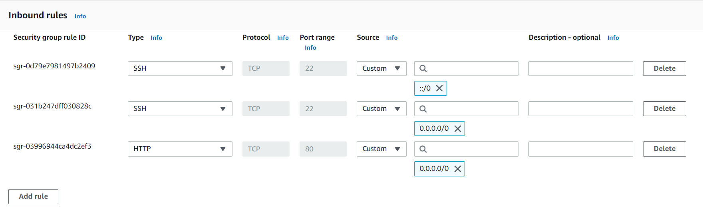

accessing nginx server locally via ubuntu

`$ curl http://localhost80`

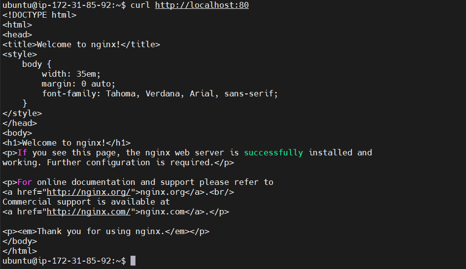

accessing nginx server via the internet using http://34.204.164.180:80

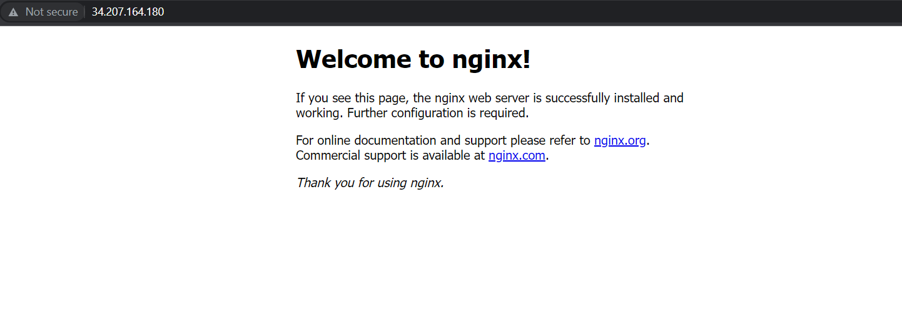

retrieving public IP address locally via ubuntu

`$ curl -s http://169.254.169.254/latest/meta-data/public-ipv4`

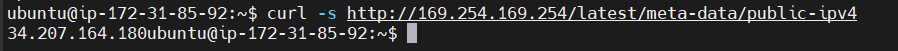

**Installing MySql**

installing mysql in the server

`$ sudo apt install mysql-server`

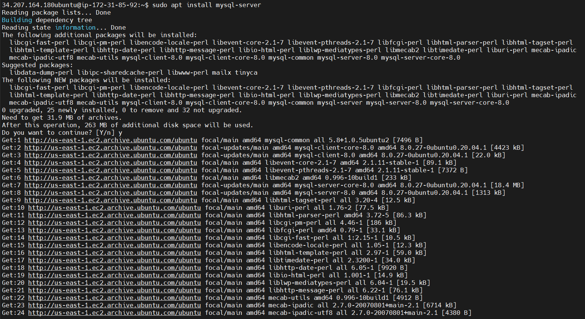

securing sql installation

`$ sudo mysql_secure_installation`

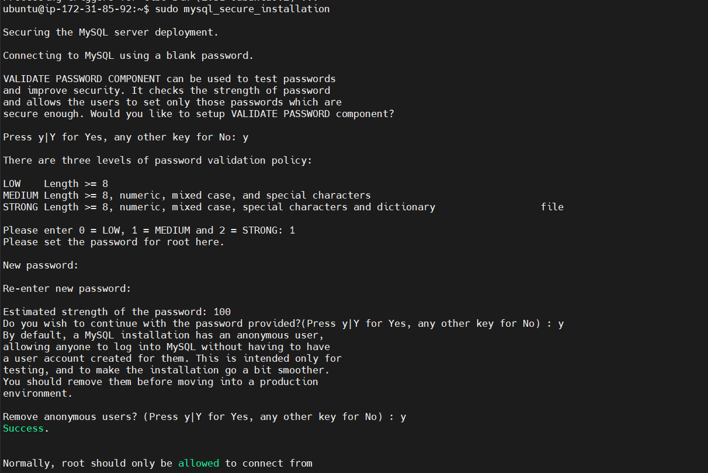

logging into mysql server

`$ sudo mysql`

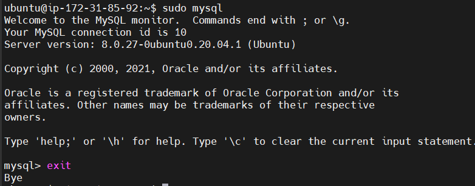

**Installing PHP**

installing 2 PHP packages: php-fpm, php-mysql

`$ sudo apt install php-fpm php-mysql`

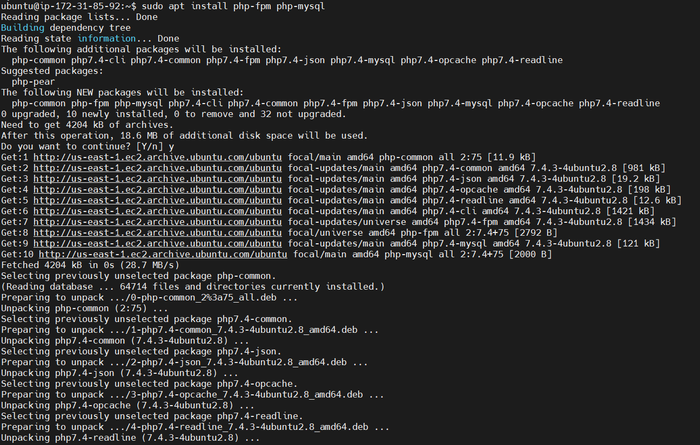

**Configuring Nginx to use PHP processor**

creating root web directory for my domain

`$ sudo mkdir /var/www/projectlemp`

assigning ownership of the directory to $USER variable

`$ sudo chown -R $USER:$USER /var/www/projectlemp`

opening a new configuration file in the nginx sites-available directory

`$ sudo nano /etc/nginx/sites-available/projectlemp`

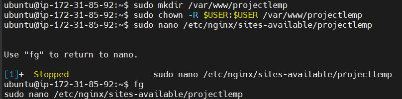

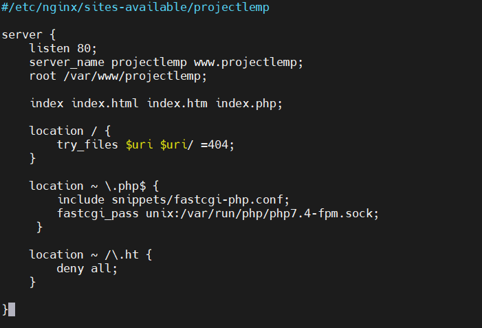

activating configuration - linking to nginx's sites-enabled directory

` $ sudo ln -s /etc/nginx/sites-available/projectlemp /etc/nginx/sites-enabled/`

testing the configuration for syntax errors

`$ sudo nginx -t`

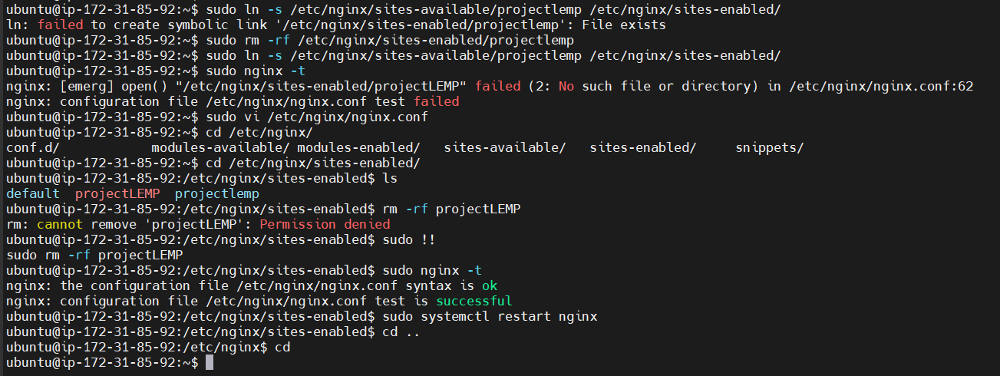

disabling default nginx host configured to listen on port 80

`$ sudo unlink /etc/nginx/sites-enabled/default`

reloading nginx to apply changes

`$ sudo systemctl reload nginx`

creating an index.html file to test new server block

`$ sudo echo 'Hello LEMP from hostname' $(curl -s http://169.254.169.254/latest/meta-data/public-hostname) 'with public IP' $(curl -s http://169.254.169.254/latest/meta-data/public-ipv4) > /var/www/projectLEMP/index.html`

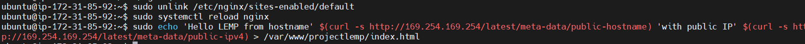

website test run using http://34.204.164.180:80

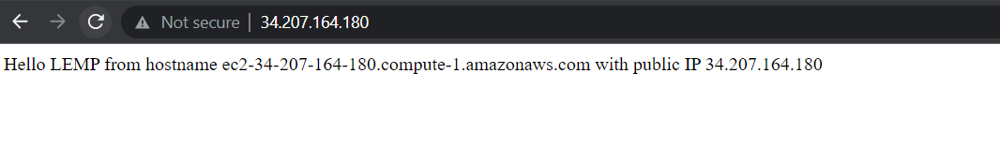

**Testing PHP with Nginx**

creating test php file in the document root

`$ sudo nano /var/www/projectLEMP/info.php`

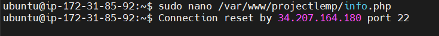

php barebones

`$ <?php
phpinfo();`

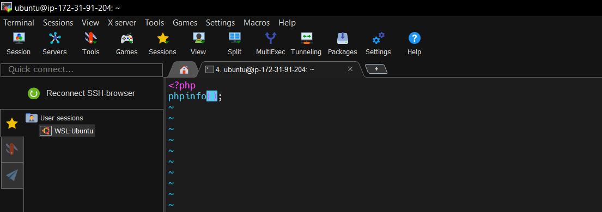

accessing web browser page using http://projectlemp/info.php

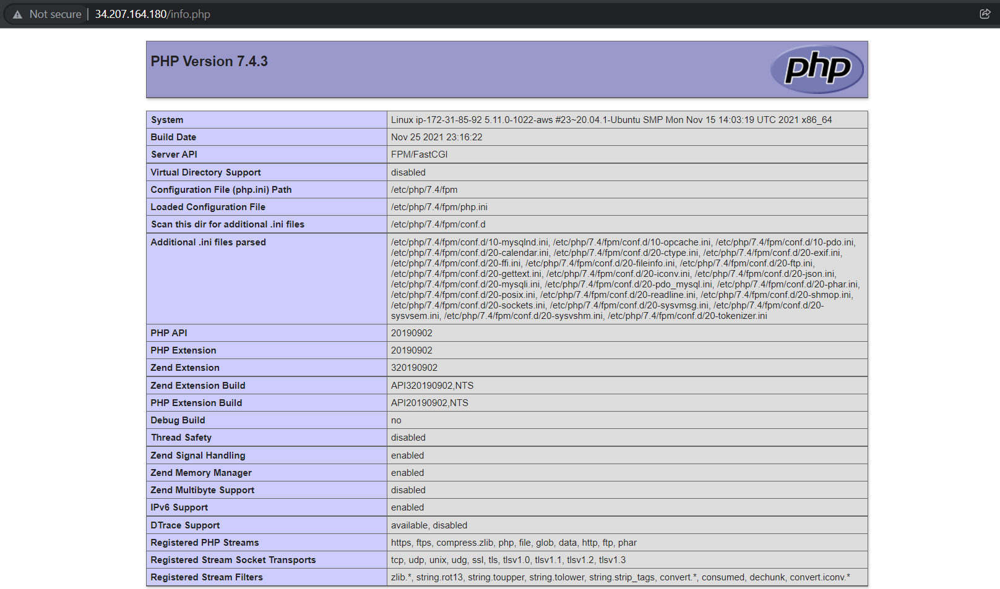

**Retrieving Data from MySql Database with PHP**

connecting to msql console using root account 

`$ sudo mysql`

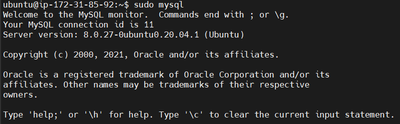

creating a new database

*mysql> CREATE DATABASE `example_database`;*

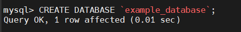

create new user account and grant full priviledge

*mysql>  CREATE USER 'example_user'@'%' IDENTIFIED WITH mysql_native_password BY 'password';*

granting access to recently created database

mysql> GRANT ALL ON example_database.* TO 'example_user'@'%';

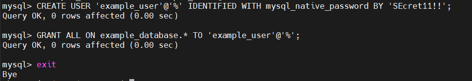

testing if user has permission

*mysql -u example_user -p*

accessing database

*mysql> SHOW DATABASES;*

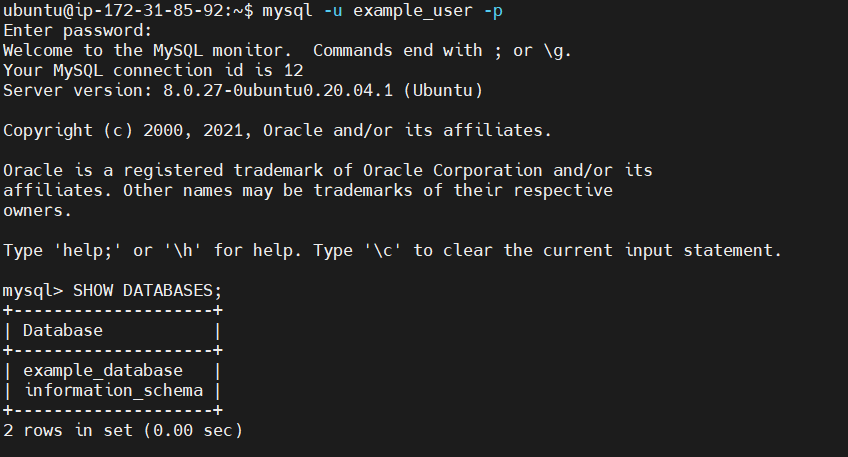

creating test table

*CREATE TABLE example_database.todo_list (
mysql>     item_id INT AUTO_INCREMENT,
mysql>     content VARCHAR(255),
mysql>     PRIMARY KEY(item_id)
mysql> );*

adding content to test table

*mysql> INSERT INTO example_database.todo_list (content) VALUES ("My first important item");*

querying test table 

*mysql>  SELECT * FROM example_database.todo_list;*

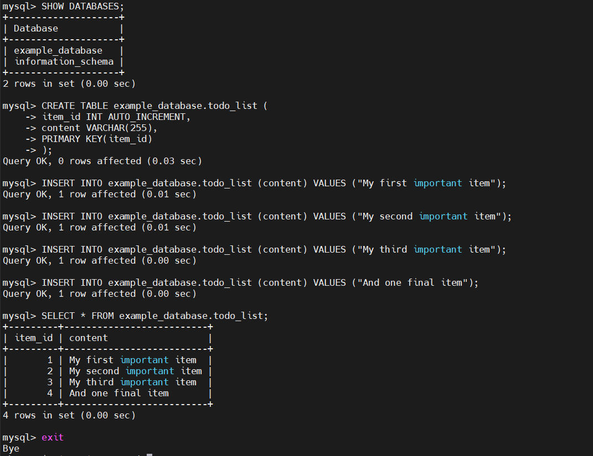

creating php script that will connect to mysql

`$ vi /var/www/projectLEMP/todo_list.php`

`$ <?php
$user = "example_user";
$password = "password";
$database = "example_database";
$table = "todo_list";

try {
  $db = new PDO("mysql:host=localhost;dbname=$database", $user, $password);
  echo "<h2>TODO</h2><ol>";
  foreach($db->query("SELECT content FROM $table") as $row) {
    echo "<li>" . $row['content'] . "</li>";
  }
  echo "</ol>";
} catch (PDOException $e) {
    print "Error!: " . $e->getMessage() . " ";
    die();
}`

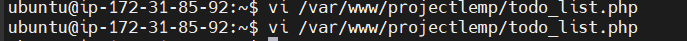

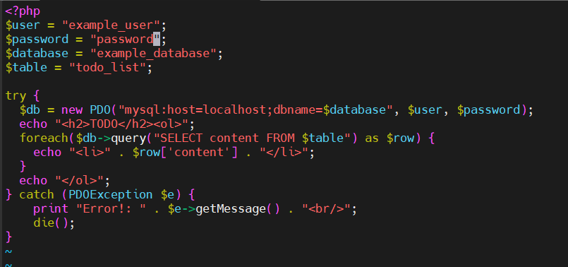

accessing page via web browser using http://projectlemp/todo_list.php

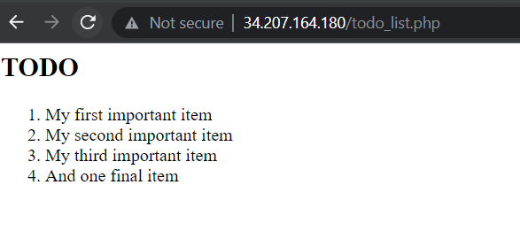