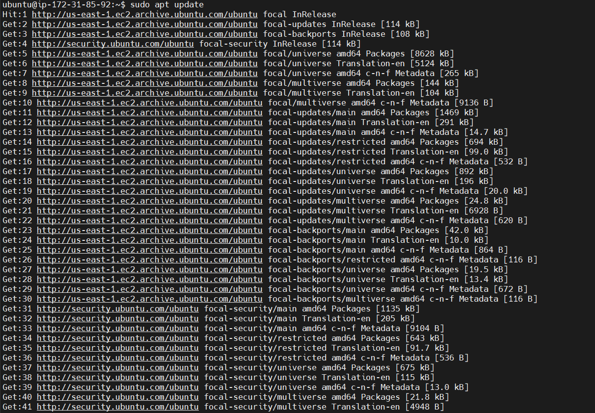
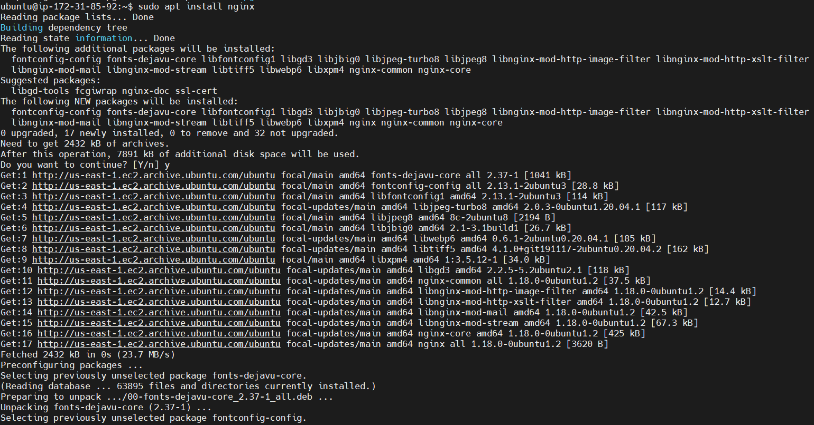
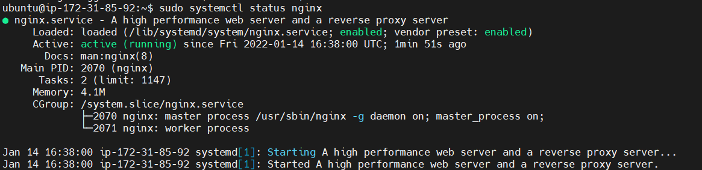

# Project 2

**Installing the Nginx Web Server**

____

updating server package index

`$ sudo apt update`

installing nginx

`$ sudo apt install nginx`

verifing that nginx is installed and running as a service

`$sudo systemctl status nginx`

